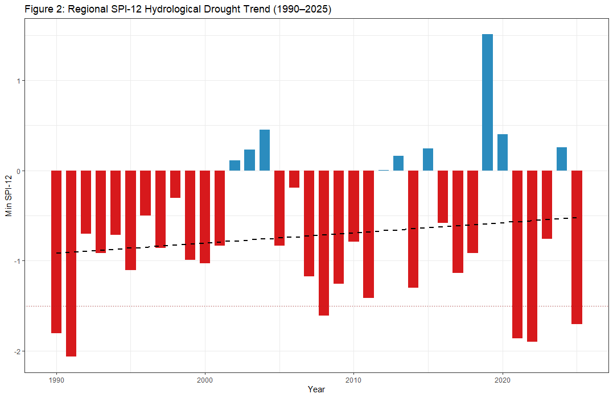
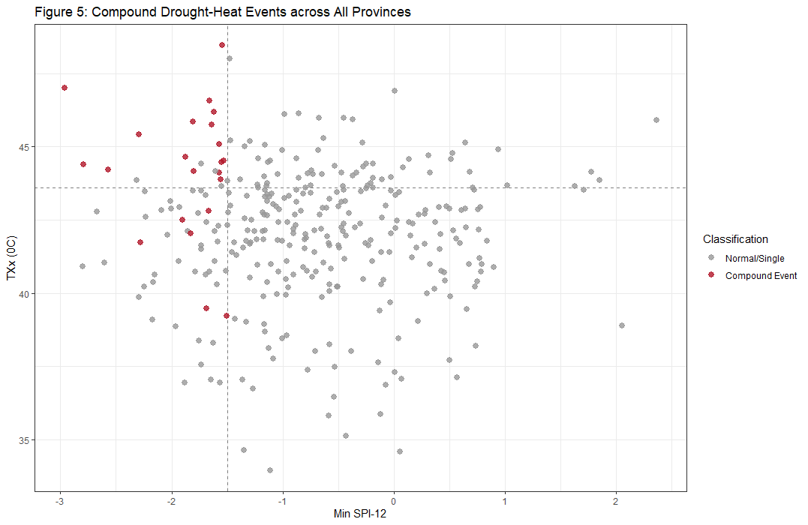
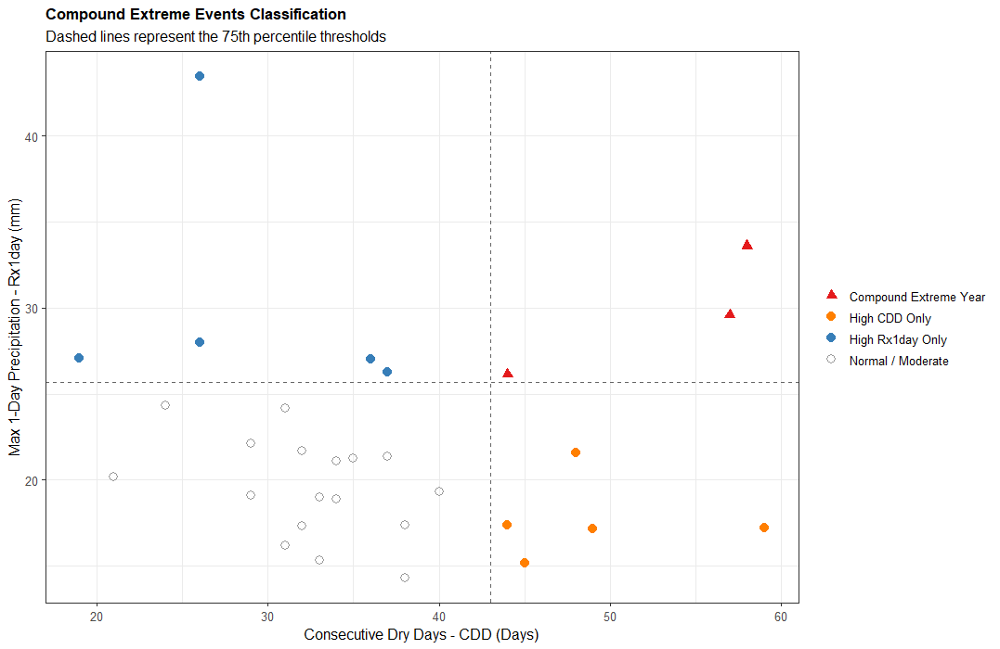
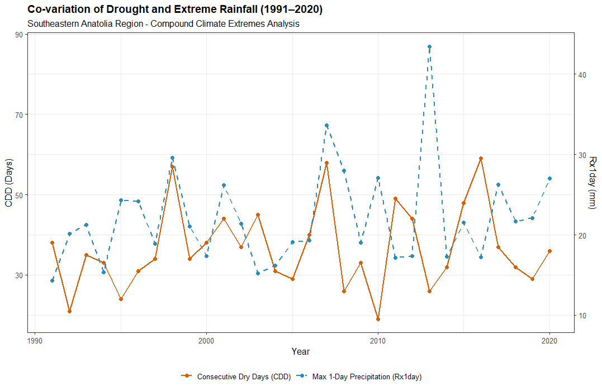
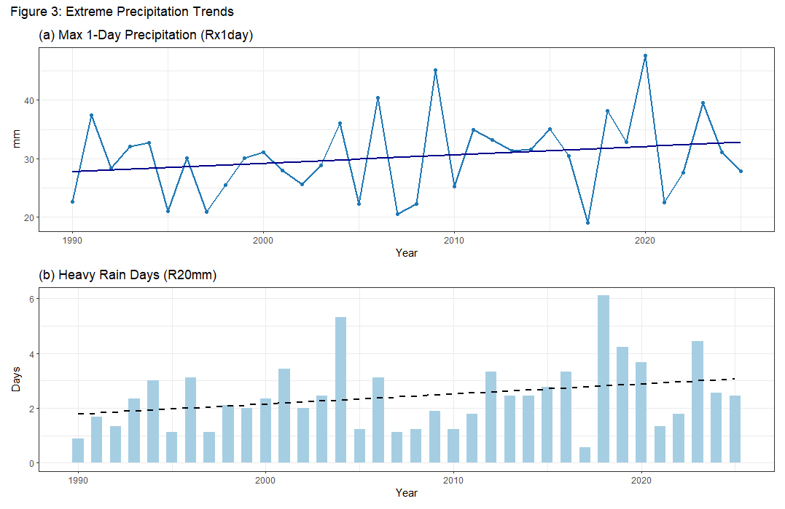
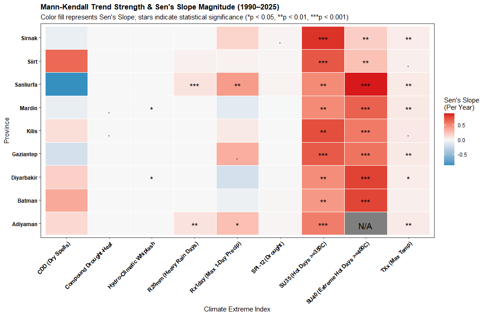
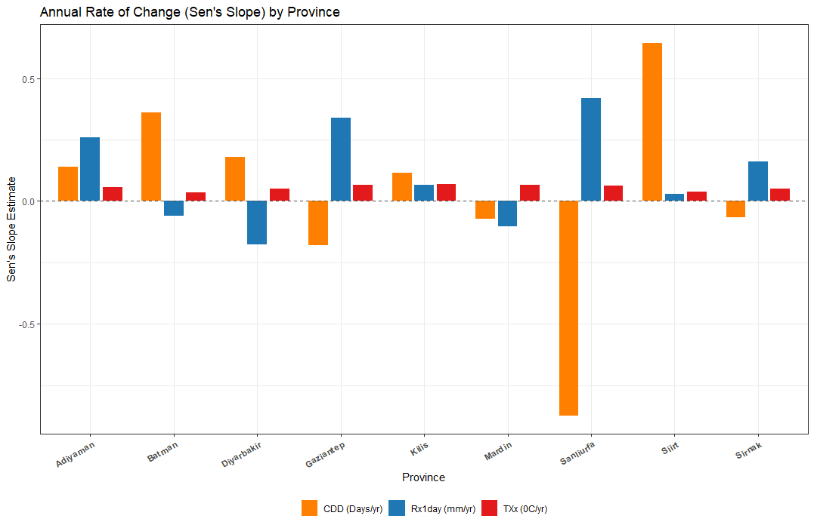
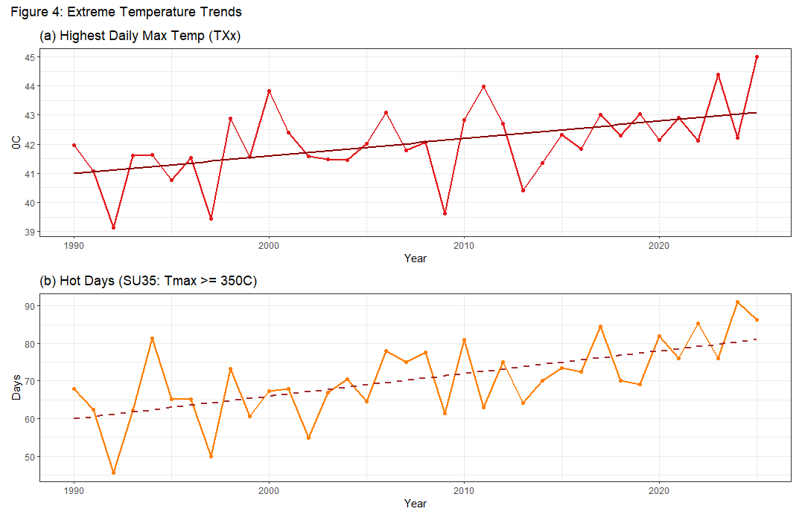
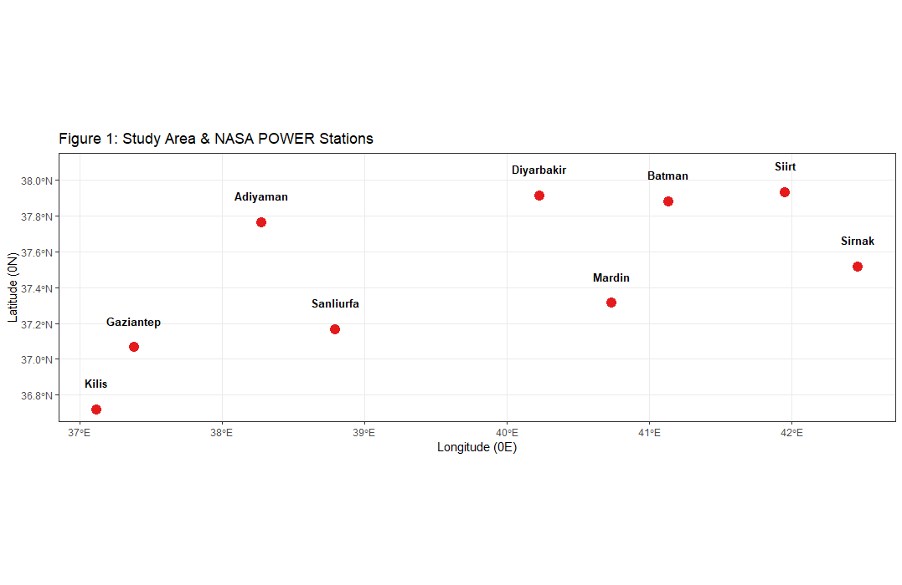
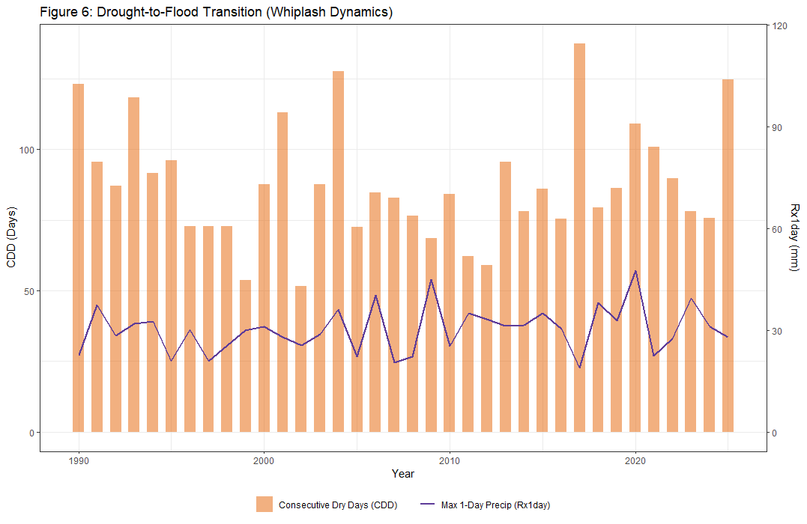

# Compound Climate Extremes in Southeastern Türkiye

## Drought, Extreme Precipitation and Temperature Extremes (1990–2025)

---

## Research Overview

Climate change is increasingly characterized not only by changes in
individual climatic variables, but also by the increasing occurrence of
multiple climate extremes occurring simultaneously or in close
succession.

This project investigates the temporal and spatial characteristics of
compound climate extremes across Southeastern Türkiye during the
1990–2025 period.

The study integrates drought conditions, extreme precipitation and
temperature extremes within a unified hydroclimatic framework.

The analysis covers nine provinces:

**Adıyaman · Batman · Diyarbakır · Gaziantep · Kilis · Mardin · Siirt ·
Şanlıurfa · Şırnak**

The main objective is to determine whether the frequency, intensity and
spatial distribution of climate extremes have changed over time and
whether different types of extremes are becoming increasingly
interconnected.

---

# Key Research Questions

The project addresses six main research questions:

### 1. Drought

How have short-term and long-term drought conditions changed across
Southeastern Türkiye between 1990 and 2025?

### 2. Extreme Precipitation

Have intense precipitation events and prolonged wet or dry periods
changed during the study period?

### 3. Temperature Extremes

Are extreme temperature conditions becoming more frequent or persistent?

### 4. Compound Drought–Heat Events

Are drought and extreme heat occurring simultaneously more frequently?

### 5. Drought-to-Flood Transitions

Are prolonged dry conditions increasingly followed by extreme
precipitation events?

### 6. Spatial Differences

Which provinces exhibit the strongest changes in compound climate
extremes?

---

# Study Area

Southeastern Türkiye represents an important climate-sensitive region
characterized by semi-arid conditions, high agricultural dependence and
substantial hydroclimatic variability.

The study includes:

- Adıyaman
- Batman
- Diyarbakır
- Gaziantep
- Kilis
- Mardin
- Siirt
- Şanlıurfa
- Şırnak

The province-level approach allows regional differences in climate
extremes to be identified rather than treating Southeastern Türkiye as
a homogeneous climatic region.

---

# Main Results and Visualizations

The following figures summarize the principal spatial, temporal and
statistical components of the analysis.





















---

# Data

Meteorological data are obtained from the
**NASA Prediction of Worldwide Energy Resources (NASA POWER)**
database.

### Temporal Coverage

**1990–2025**

### Primary Climate Variables

- Precipitation
- Mean air temperature
- Maximum air temperature
- Minimum air temperature

These variables provide the basis for the characterization of
hydroclimatic variability and climate extremes.

---

# Methodological Framework

The analytical framework consists of five major components.

## 1. Drought Analysis

Drought variability is assessed using standardized precipitation
indices with different accumulation periods.

### SPI-3

Represents short-term precipitation anomalies and provides information
about relatively rapid drought development.

### SPI-12

Represents longer-term precipitation variability and is used to
identify persistent hydroclimatic drought conditions.

---

## 2. Extreme Precipitation Analysis

Precipitation extremes are investigated using indicators representing
both intense precipitation and persistent wet or dry conditions.

The analysis considers:

- Extreme precipitation frequency
- Maximum precipitation events
- Consecutive Dry Days (CDD)
- Consecutive Wet Days (CWD)
- Precipitation anomalies

---

## 3. Temperature Extremes

Temperature extremes are evaluated using maximum and minimum
temperature characteristics.

The analysis includes:

- Mean temperature
- Maximum temperature
- Minimum temperature
- Temperature anomalies
- Extreme heat conditions
- Extreme cold conditions
- Percentile-based thresholds

Percentile-based approaches allow extreme conditions to be evaluated
relative to the climatic characteristics of each location.

---

## 4. Trend and Change-Point Analysis

Long-term changes are evaluated using non-parametric statistical
methods.

### Mann–Kendall Test

Used to identify statistically significant monotonic trends without
requiring normally distributed observations.

### Sen's Slope Estimator

Used to quantify the magnitude and direction of detected trends.

### Pettitt Test

Used to identify potential abrupt change points within the time series.

These methods provide complementary information regarding both gradual
and abrupt changes in climate-extreme behavior.

---

# 5. Compound Climate Extremes

The central component of the project is the identification of
interacting climate extremes.

## Compound Drought–Heat Events

Events characterized by the simultaneous occurrence of:

**Dry conditions + extreme temperature**

are classified as compound drought–heat events.

Their frequency and spatial distribution are evaluated at the province
level.

---

## Drought-to-Flood Transitions

The study also examines transitions from prolonged dry conditions to
subsequent extreme precipitation.

Conceptually:

```text
Prolonged Dry Conditions
          ↓
Hydroclimatic Transition
          ↓
Extreme Precipitation
NASA POWER Climate Data
            ↓
Data Acquisition
            ↓
Quality Control
            ↓
Temporal Aggregation
            ↓
Drought Indicators
            ↓
Precipitation Extremes
            ↓
Temperature Extremes
            ↓
Mann–Kendall Trend Analysis
            ↓
Sen's Slope Estimation
            ↓
Pettitt Change-Point Detection
            ↓
Compound Event Detection
            ↓
Spatial Comparison
            ↓
Climate-Risk Interpretation
Compound-Climate-Extremes-in-Southeastern-Türkiye/
│
├── README.md
│
├── data/
│   ├── raw/
│   └── processed/
│
├── scripts/
│
├── figures/
│
├── results/
│
└── LICENSE
Keywords

Compound Climate Extremes

Southeastern Türkiye

Climate Change

Drought

Extreme Precipitation

Temperature Extremes

Compound Drought–Heat

Drought-to-Flood Transitions

SPI

Mann–Kendall

Sen's Slope

Pettitt Test

NASA POWER

Hydroclimatology

Climate Risk
Author

Ahmet Solmaz

Geography | Climate Change | Environmental Analysis
